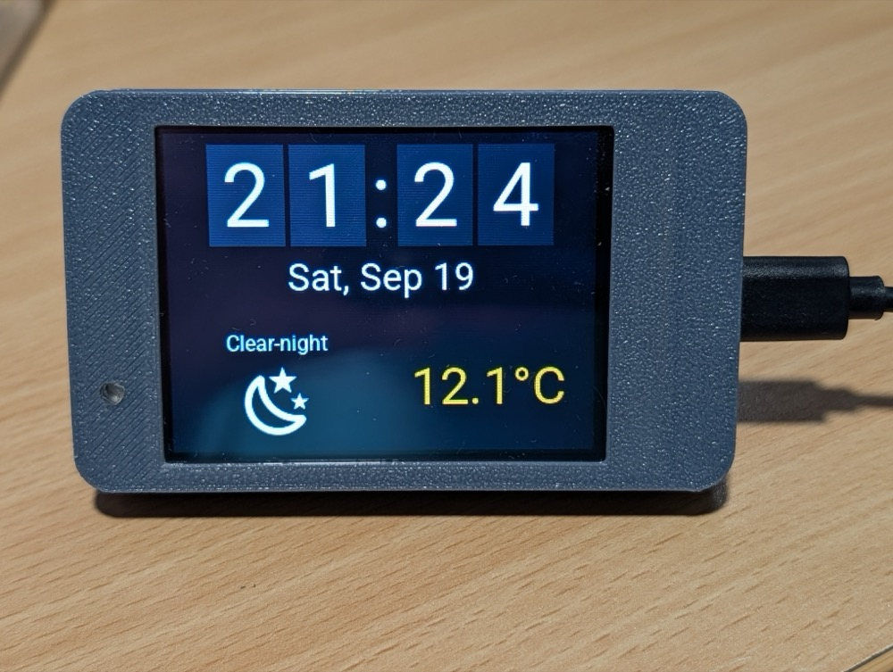
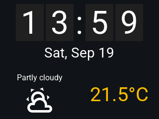

# Split-flap weather clock

An ESPHome/LVGL split-flap style HH:MM clock with a status bar underneath
showing today's date, the current weather condition (as an icon + text) and
outside temperature, pulled from Home Assistant. It runs both on real
hardware (a Sunton ESP32-2432S028 "CYD" board) and as a native binary on a
desktop machine (via ESPHome's `host:` platform + SDL window), for fast
iteration without flashing real hardware.





## Layout

| File | Included via | What it is |
|---|---|---|
| `clock-base.yaml` | `packages:` | Clock plumbing: per-digit state/scripts, the digit font, the driver scripts that flip a synchronized run of digits |
| `clock-widget.yaml` | inline `!include` inside a `widgets:` list | The clock face itself, an LVGL widget fragment |
| `weather-base.yaml` | `packages:` | Weather plumbing: Home Assistant sensors, the MDI-icon mapping, the status bar's fonts |
| `weather-widget.yaml` | inline `!include` inside a `widgets:` list | The date/weather/temperature status bar, an LVGL widget fragment |
| `flip-digit-logic.yaml` / `flip-digit-widget.yaml` | used by `clock-base.yaml`/`clock-widget.yaml` | One split-flap digit cell (state/animation + widget tree), instantiated four times (`h0`, `h1`, `m0`, `m1`) |
| `host.yaml` | top-level config | Runs on a desktop as a native binary, SDL window, for development |
| `cyd.yaml` | top-level config | Runs on the real Sunton ESP32-2432S028 hardware - see [Construction](#construction) |
| `flip-snapshot.yaml` | top-level config | Headless debug target: drives the clock through a scripted sequence of digit flips and dumps each frame to a `.bmp`, for inspecting the flap animation pixel-by-pixel without a screen |
| `flip-demo.yaml` | top-level config | Headless target that records `flip-demo.gif` (the minute-rollover clip above) |

Each module is a **base + widget pair**. The base file is included the
normal way, via `packages:`, because it declares top-level component keys
(`font:`, `sensor:`, `script:`, `mapping:`, ...) that only a package merge
can splice into a config. The widget file is a *fragment* - its root is a
bare `obj:`/`container:` mapping, not wrapped in `lvgl: widgets: [...]` -
so it can be dropped straight into any parent's `widgets:` list with a
plain inline `!include`, at the screen root or nested inside some other
panel deep in a larger layout. A package can only append to the *same*
top-level list as its includer; an inline `!include` can nest anywhere.

A base file must be included before its paired widget file references the
things it declares (the fonts, mostly) - see how `host.yaml`/`cyd.yaml`
order their `packages:` block before their `lvgl: widgets:` block.

To drop the clock and/or weather bar into a layout of your own:

```yaml
packages:
  clock_base: !include
    file: clock-base.yaml
    vars:
      base_height: 240   # see "Sizing" below
      time_id: my_time_id
  weather_base: !include
    file: weather-base.yaml
    vars:
      base_height: 240
      time_id: my_time_id

lvgl:
  widgets:
    - obj:
        # ... your own layout ...
        widgets:
          - !include {file: clock-widget.yaml, vars: {align: top_mid}}
          - !include {file: weather-widget.yaml, vars: {align: bottom_mid}}
```

`time_id` names whichever `time:` platform you've already declared for
real wall-clock time (see `host.yaml`'s `platform: host` block or
`cyd.yaml`'s `platform: sntp` block) - declaring that platform, and hooking
its `on_time_sync`/`on_time` triggers to `script.execute: clock_tick`, is
the including config's job, not the clock module's, since the right
platform and re-tick schedule are target choices.

## Sizing

Both base files take a `base_height` parameter: the height, in pixels, of
the space being laid out. Every font size (and the weather icon's resize
target) is a fixed fraction of it, tuned against a 240px-tall panel - the
size these Sunton boards' screens present after LVGL's 90-degree rotation
- so the default reproduces today's look and scales cleanly to a
differently-sized layout slot (e.g. embedding just the weather bar as a
small panel in a bigger dashboard). The arithmetic is plain [Jinja
expressions](https://esphome.io/guides/configuration-types#substitutions)
inside `${...}`, e.g. `clock-base.yaml`'s digit font:

```yaml
substitutions:
  base_height: 240
  digit_font_size: ${math.floor(base_height * 4 / 15)}
```

`clock-widget.yaml`/`weather-widget.yaml` themselves take no size
parameters - only layout/theme ones (`align`, and the weather bar's
`text_color`/`icon_recolor`/`temperature_color`) - since a widget
*fragment*'s root can hold nothing but its one widget key, unlike a
package. Where a fragment sits within its parent, and how it should be
themed, are decisions for whoever is embedding it, so `align` has no
default and must always be supplied; the weather bar's colors default to a
light-on-dark theme via Jinja's `|default(...)` filter and can be
overridden the same way `base_height` is.

## Home Assistant entities

`weather-base.yaml` defaults to the entities this was built against
(`weather.forecast_dexfield_park` and
`sensor.st_00141258_temperature`) - override `weather_entity_id` and
`outside_temp_entity_id` in its `vars:` to point at your own Home
Assistant weather/temperature entities, the same way `base_height` is
overridden.

## Construction

The hardware target (`cyd.yaml`) is a [Sunton
ESP32-2432S028](https://randomnerdtutorials.com/cheap-yellow-display-esp32-2432s028r/) ("CYD" -
Cheap Yellow Display) 2.8" 240x320 touchscreen board, in a 3D-printed case:
[Desk stand for XTouch using
ESP32-2432S028](https://makerworld.com/en/models/49607-desk-stand-for-xtouch-using-esp32-2432s028)
on MakerWorld.

Note that the ESP32-2432S028 comes in at least three variants, differing in
the LCD panel used, and the USB ports. The original has a single micro-USB port
and an ILI9341 driver chip, and a rather poor LCD panel (viewing angle is
limited, leading to low contrast.)

The later versions add a USB-C port (can be used interchangably with the micro-USB port)
and use either an ST7789V or ILI9342 display driver chip. These have a much better
LCD panel with improved viewing angle and contrast. In all other respects the
different variants are unchanged.

The correct `mipi_spi` display model must be chosen in the cyd.yaml file for
the specific board used.

### Ambient light sensor mod

`cyd.yaml`'s `ambient_light` sensor (an LDR feeding an ADC pin, on
`GPIO34`) drives the backlight brightness automatically. On these boards
as sold, the LDR divider's two resistors (R15 and R19) make the LDR quite
insensitive, and the output voltage range is very limited.
This can be fixed by replacing one resistor with a filter capacitor and the
other with a better size for the voltage divider function.

Replace them as follows:

- **R19**: originally a 1M resistor - replace with a **100nF capacitor**
- **R15**: originally a 1M resistor - replace with a **100K resistor**

Both are 0603-scale SMD parts on the board's underside, next to the
LDR footprint - a fine-tipped iron and tweezers are enough, no hot air
needed. It's quite practical to install 0805 size parts on the existing pads.

| Before | After |
|---|---|
|  |  |

The LDR itself stays on the front of the board:


Once the board is inside the case, that LDR is coupled to the outside
world with a 3mm clear plastic light pipe, pushed through a hole drilled
in the case front to match the LDR's position (visible as the small hole
in the case bezel, left of the screen, in the photo at the top of this
file).
