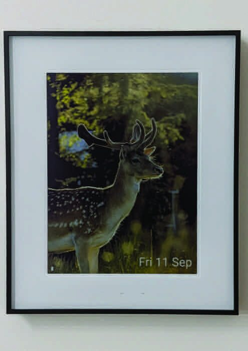
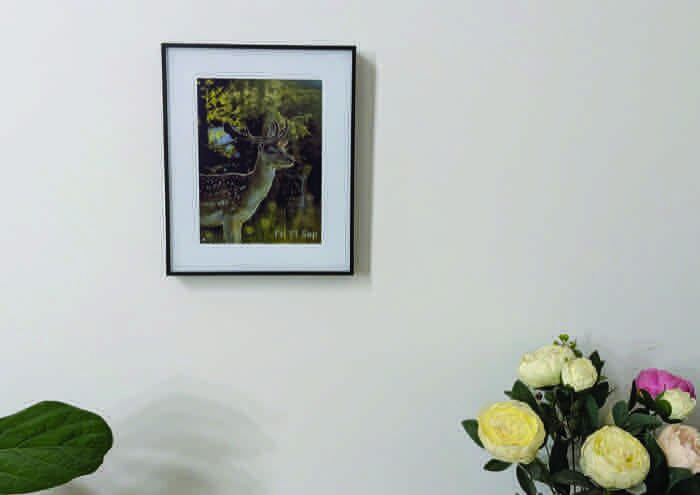

# e1004 Picture Frame

An ESPHome config for the [Seeed reTerminal E1004](https://www.seeedstudio.com/reTerminal-E1004-p-6534.html), a battery-powered e-paper display. It wakes up once a day, downloads a fresh dithered photo, shows it with the date and battery level overlaid, then goes back to deep sleep until the next day.

|                                          |                                                |
|------------------------------------------|------------------------------------------------|
|  |       |

The source image is a 1200x1600 PNG that is re-generated and re-uploaded once a day, dithered so it looks good on the panel's 6-color Spectra E6 e-paper (black, white, red, yellow, blue, green — no continuous grey/color ramp, so dithering is what gives the illusion of a full-color photo). Since the URL content changes daily but the URL itself doesn't, the frame just re-fetches the same address each morning to pick up that day's picture.

## Files

- `picture.yaml` — the main config: display, image download, LVGL UI, battery sensing, sleep scheduling, buttons, buzzer.
- `standard.yaml` — shared boilerplate (`!include`d from `picture.yaml`): device name, logger, API, OTA, restart button, uptime/WiFi diagnostics.
- `wifi.yaml` — WiFi credentials and connection tuning (`!include`d by `standard.yaml`).
- `secrets.yaml` — symlinked to `../secrets.yaml`, holds the actual WiFi/API secrets (not committed).

## How `picture.yaml` works

**Hardware setup.** The `esp32:` block targets an ESP32-S3 with 32MB of flash, built with the `esp-idf` framework (needed for the experimental features flag). `psram: mode: octal` enables the frame's octal PSRAM, which is needed to hold the decoded 1200x1600 image in memory. `spi:` and `display:` set up the e-paper panel over SPI using the `epaper_spi` platform with the `seeed-reterminal-e1004` model preset.

**Fetching the daily image.** The `image:` component (`platform: online_image`) downloads `https://storage.googleapis.com/dexfieldpark-daily-image/latest.png` and decodes it as a 1200x1600 `RGB565` bitmap. It isn't fetched on a timer — `component.update: daily_image` is called explicitly once a day (see the script below). When the download finishes, `on_download_finished` fires a small chain of actions:
1. push the freshly-decoded image into the LVGL image widget (`lv_image`),
2. log that the update happened,
3. update the date label to today's date, and
4. `lvgl.resume` — LVGL normally sits paused (see below), so this is what actually lets the new frame get drawn to the display.

**LVGL UI.** `lvgl:` is configured with `paused: true` and `update_when_display_idle: true`, so it does no redraw work until explicitly resumed — this matters because the e-paper display is slow to refresh and you don't want spurious partial redraws. The widget tree is just three layers: the full-screen photo (`lv_image`), a date label bottom-right, and a battery-icon label bottom-left. `buffer_size: 25%` limits the LVGL render buffer to a quarter of the screen to keep RAM use down.

**Fonts.** Two font entries are declared: `roboto`, a Google Font used for the date text and pulling in a handful of glyphs for weekday/month abbreviations, and `battery_font`, which layers Roboto (digits, `%`) together with glyphs from Google's "Material Symbols Outlined" icon font (battery-level icons) into a single font so the battery label can mix text and icon glyphs.

**Daily wake/refresh/sleep cycle.** This is the heart of the config, implemented as two scripts plus `deep_sleep:`:
- `deep_sleep:` puts the board into deep sleep, staying awake for `run_duration: 240s` after each wake before it's allowed to sleep again, and can also be woken early by a GPIO button (`wakeup_pin`, pin 5).
- `wifi: on_connect:` triggers `run_once_awake` every time the device connects to WiFi after waking.
- `run_once_awake`: enables the battery-voltage divider, waits (up to 15s) for SNTP to get real time, refreshes the image (`component.update: daily_image`, which triggers the download chain above), pauses 5s, updates the battery sensor, disables the battery divider again (to stop it drawing current), waits for the e-paper display to finish its refresh (`wait_until: component.is_idle: display_id`), then hands off to `go_to_sleep_until_4am`.
- `go_to_sleep_until_4am`: a `lambda:` computes how many seconds remain until 4:00 AM (using the current SNTP time), sets that as the deep-sleep duration, and puts the board to sleep. The image is thus refreshed once daily, timed to whenever the board happens to wake near 4am.

**Battery monitoring.** `sensor: platform: adc` reads GPIO1 through a voltage divider (only powered on briefly via `battery_volts_enable`, a GPIO switch, to save power the rest of the time), doubles the reading (`multiply: 2.0` to undo the divider), then converts raw volts to an estimated percentage via a `calibrate_linear` lookup table tuned to the battery's discharge curve, and clamps the result to 0–100%. `on_value` maps that percentage into 0–8 "bars" and looks up the matching Material Symbols battery glyph via the `mapping:` component, which then updates `battery_label`.

**Buttons and buzzer.** Three `binary_sensor: platform: gpio` entries expose the frame's physical buttons (Refresh/Left/Right — GPIO5/4/3). `rtttl:` drives a piezo buzzer on `output: platform: ledc` (GPIO45), and `esphome: on_boot:` plays a short two-note RTTTL chime on startup.
